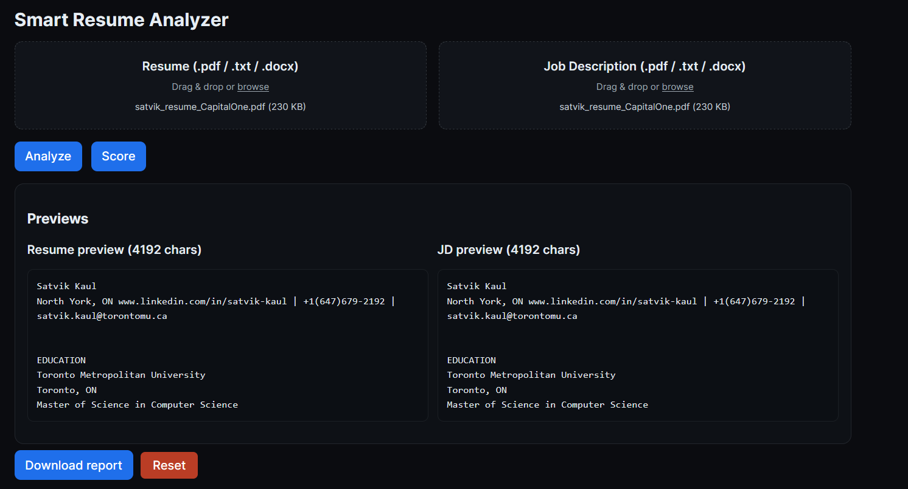

# Smart Resume Analyzer

👉 **[Live Demo – Frontend UI](https://job-fit-analyzer.netlify.app/)**  
👉 **[Backend API Docs](https://smart-resume-analyzer-2nwb.onrender.com/docs)**  

Smart Resume Analyzer matches resumes to job descriptions, evaluates tone, and suggests actionable rewrites using rule-based NLP with optional LLM support.

## Score Endpoint 


## Setup

### Backend
1. Install Python 3.11+.
2. Create a virtual environment and install dependencies:
   ```bash
   python -m venv .venv
   source .venv/bin/activate
   pip install -r requirements.txt
   ```
### Frontend
1. Install Node.js 18+.
2. From the project root, install dependencies for the UI:
   ```bash
   cd smart-resume-ui
   npm install
   ```
3. Create a `.env` file in `smart-resume-ui` to configure the API endpoint:
   ```bash
   VITE_API_BASE_URL=http://localhost:8000
   ```

## Development server

* Start the FastAPI backend:
  ```bash
  uvicorn main:app --reload
  ```
* In another terminal, start the Vite dev server:
  ```bash
  cd smart-resume-ui
  npm run dev
  ```
  The app will be available at `https://smart-resume-analyzer-2nwb.onrender.com` and will use `VITE_API_BASE_URL` for API requests.

## Build

To build the frontend for production:
```bash
cd smart-resume-ui
npm run build
```
The build output is written to `smart-resume-ui/dist`. You can preview the production build with:
```bash
npm run preview
```


